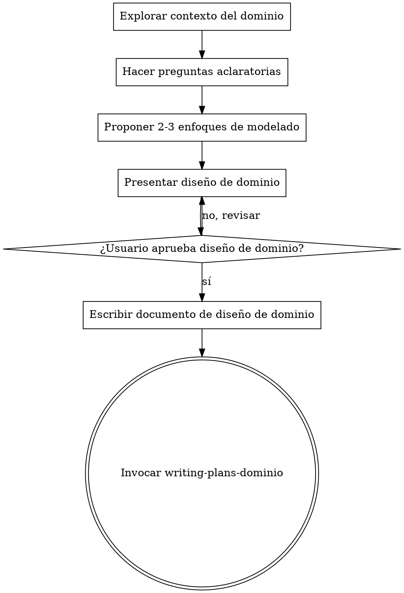

# Convertir Ideas en Diseño de Dominio

## Descripción General

Ayuda a diseñar el **dominio** de forma estricta y estructurada mediante un diálogo colaborativo natural. Solo se enfoca en **entidades, agregados, value objects, reglas de negocio y relaciones de dominio**. No debes escribir código, crear estructuras de proyecto, ni pensar en infraestructura o implementación.

<HARD-GATE>
NO invocar ninguna skill de implementación, NO escribir código, NO generar estructura de proyecto ni tomar ninguna acción de implementación hasta obtener aprobación del diseño de dominio del usuario.
</HARD-GATE>

<REPOSITORY-CONSTRAINT>
No se debe usar `.worktree`, `git worktree` ni estrategias basadas en múltiples worktrees en ninguna fase de brainstorming de dominio.
</REPOSITORY-CONSTRAINT>

## Anti-Patrón: "Esto es demasiado simple para diseñar"

Todo diseño de dominio debe pasar por este proceso, incluso si parece simple. El diseño puede ser breve, pero **DEBE presentarse y obtener aprobación**.

## Checklist de Brainstorming de Dominio

1. **Explorar contexto del dominio** — Revisar documentación, reglas de negocio, requisitos y entidades existentes.
2. **Hacer preguntas aclaratorias** — Una a la vez, para entender el propósito, invariantes y criterios de éxito.
3. **Proponer 2-3 enfoques de modelado de dominio** — Con ventajas, desventajas y recomendación.
4. **Presentar el diseño de dominio** — Cubrir agregados, entidades, value objects, relaciones, invariantes y reglas de negocio; obtener aprobación incremental.
5. **Escribir documento de diseño de dominio** — Guardarlo en `docs/plans/YYYY-MM-DD-<tema>-domain-design.md` y hacer commit.
6. **Transición a planificación de implementación de dominio** — Invocar la skill `writing-plans-dominio` una vez aprobado el diseño.

## Flujo del Proceso

## Principios Clave

- **Una pregunta a la vez** — No abrumar con múltiples preguntas.
- **Opciones múltiples cuando sea posible** — Más fácil de responder y comparar trade-offs.
- **YAGNI en el dominio** — No agregar complejidad innecesaria; solo modelar lo que importa al negocio.
- **Explorar alternativas de modelado** — Presentar 2-3 enfoques antes de decidir.
- **Validación incremental** — Presentar diseño por secciones, obtener aprobación antes de continuar.
- **Documentar todo** — Guardar diseño aprobado en un documento formal.
- **Transición clara a implementación** — Solo invocar `writing-plans-dominio` tras aprobación.

## Proceso Detallado

**Entendiendo el dominio:**

- Revisar documentación y reglas de negocio.
- Hacer preguntas sobre entidades, relaciones, invariantes, agregados y value objects.
- Enfocarse en **propósito, invariantes, límites del agregado, reglas de negocio y relaciones de dominio**.

**Explorando enfoques:**

- Presentar 2-3 alternativas de modelado (por ejemplo, diferentes límites de agregados, composición de value objects, o estructura de entidades).
- Explicar ventajas, desventajas y recomendar la mejor opción.

**Presentando el diseño de dominio:**

- Explicar agregados y sus raíces.
- Explicar entidades y relaciones.
- Explicar value objects y reglas de negocio importantes.
- Preguntar al usuario si el diseño tiene sentido antes de continuar a la siguiente sección.

**Después del brainstorming:**

- Guardar el diseño aprobado en `docs/plans/YYYY-MM-DD-<tema>-domain-design.md`.
- Solo después de aprobación, invocar `writing-plans-dominio` para planificar implementación.
