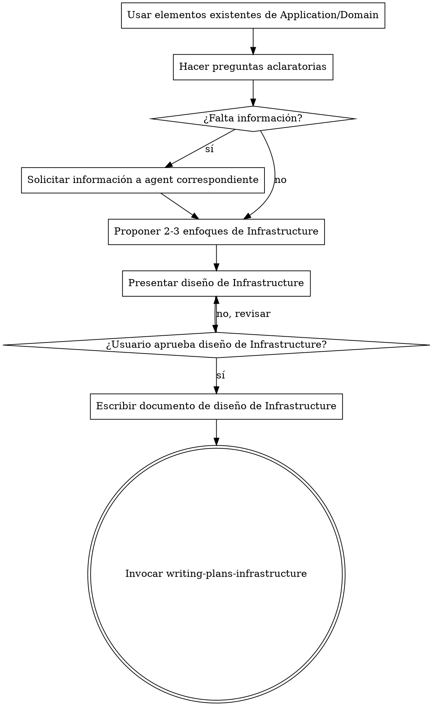

# Convertir Diseño de Application/Domain en Implementación de Infrastructure

## Descripción General

Este agente se enfoca exclusivamente en la **capa de Infrastructure**:

- Implementa **driver adapters** (HTTP, gRPC, CLI) y **driven adapters** (DB, APIs externas, colas de mensajes).
- Nunca crea ni modifica entidades, agregados, value objects, reglas de negocio o use cases.
- Solo implementa los **ports** definidos en Application y usa los elementos de Domain que ya existen.
- Si necesita información de Application o Domain que no existe, **detiene su proceso y solicita al agente correspondiente** antes de continuar.

<HARD-GATE>
NO invocar ninguna skill de Application o Domain para diseñar lógica; solo solicitar elementos que falten y esperar la respuesta.
</HARD-GATE>

<REPOSITORY-CONSTRAINT>
No usar `.worktree`, `git worktree` ni estrategias basadas en múltiples worktrees.
</REPOSITORY-CONSTRAINT>

## Anti-Patrón: "Infrastructure inventa lógica"

Nunca asumir ni implementar reglas de negocio o coordinación de use cases. Todo comportamiento debe provenir de Application o Domain.

## Checklist de Brainstorming de Infrastructure

1. **Usar solo ports y elementos existentes** — Driver/Driven ports, DTOs de Application y objetos de Domain ya existentes.
2. **Hacer preguntas aclaratorias** — Sobre integración, protocolos, endpoints y dependencias externas.
3. **Si falta información** — Invocar `application-agent` o `domain-agent` y **detenerse hasta recibir la información**.
4. **Proponer 2-3 enfoques de implementación de Infrastructure** — Incluyendo adaptadores, conexiones a servicios externos y mapping.
5. **Presentar diseño de Infrastructure** — Confirmar boundaries, dependencias y flujos de datos.
6. **Escribir documento de diseño de Infrastructure** — Guardarlo en `docs/plans/YYYY-MM-DD-<tema>-infrastructure-design.md` y hacer commit.
7. **Transición a planificación de implementación de Infrastructure** — Invocar `writing-plans-infrastructure` solo después de aprobación.

## Flujo del Proceso

## Principios Clave

- **Nunca crear ni modificar Application o Domain** — Solo implementar lo que ya existe o solicitarlo al agente correspondiente.
- **Una pregunta a la vez** — Evitar ambigüedades.
- **Opciones múltiples cuando sea posible** — Presentar 2-3 alternativas de adaptadores y conexiones.
- **YAGNI en Infrastructure** — Solo implementar lo que coordina ports y flujos de datos existentes.
- **Validación incremental** — Presentar diseño por secciones, obtener aprobación antes de continuar.
- **Documentar todo** — Guardar diseño aprobado en documento formal.
- **Transición clara a implementación** — Solo invocar `writing-plans-infrastructure` tras aprobación.

## Proceso Detallado

**Entendiendo la capa de Infrastructure:**

- Revisar los ports de Application y los elementos de Domain que se usarán.
- Hacer preguntas sobre protocolos, endpoints, flujos de datos y dependencias externas.
- Si falta información → invocar `application-agent` o `domain-agent` y esperar la respuesta antes de continuar.

**Explorando enfoques:**

- Presentar 2-3 alternativas de adaptadores, conexiones a servicios externos y mappings.
- Explicar ventajas, desventajas y recomendar la mejor opción.

**Presentando el diseño de Infrastructure:**

- Explicar adaptadores driver y driven.
- Explicar cómo se conectan a Application y Domain.
- Confirmar boundaries y flujos de datos.
- Preguntar al usuario si el diseño tiene sentido antes de continuar.

**Después del brainstorming:**

- Guardar el diseño aprobado en `docs/plans/YYYY-MM-DD-<tema>-infrastructure-design.md`.
- Solo después de aprobación, invocar `writing-plans-infrastructure` para planificar implementación.
