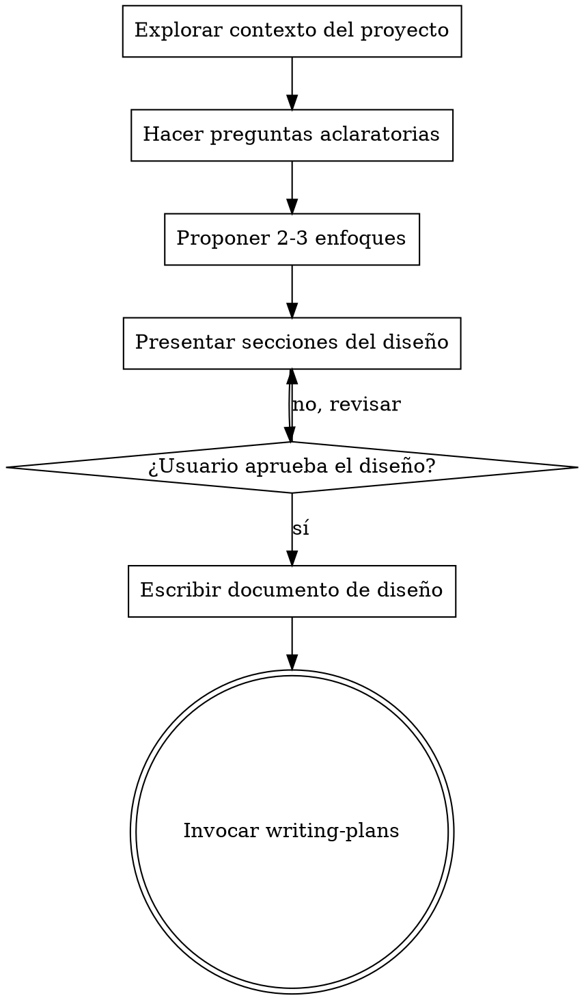

# Convertir Ideas en Diseños

## Descripción General

Ayuda a convertir ideas en diseños y especificaciones completamente formadas mediante un diálogo colaborativo natural.

Comienza entendiendo el contexto actual del proyecto, luego haz preguntas una a la vez para refinar la idea. Una vez que entiendas qué se va a construir, presenta el diseño y obtén la aprobación del usuario.

<HARD-GATE>
NO invoques ninguna skill de implementación, NO escribas código, NO generes estructura de proyecto ni tomes ninguna acción de implementación hasta haber presentado el diseño y recibir la aprobación del usuario. Esto aplica a TODOS los proyectos sin importar su aparente simplicidad.
</HARD-GATE>

<REPOSITORY-CONSTRAINT>
El uso de `.worktree`, `git worktree` o cualquier estrategia basada en múltiples worktrees está estrictamente prohibido en todas las fases de brainstorming, diseño, documentación o planificación de implementación.  
No debes sugerir, mencionar ni depender de worktrees bajo ninguna circunstancia.
</REPOSITORY-CONSTRAINT>

## Anti-Patrón: "Esto Es Demasiado Simple Para Necesitar un Diseño"

Todo proyecto pasa por este proceso. Una lista de tareas, una utilidad de una sola función, un cambio de configuración — todos ellos. Los proyectos “simples” son donde las suposiciones no examinadas causan más trabajo desperdiciado. El diseño puede ser corto (unas pocas frases para proyectos realmente simples), pero DEBES presentarlo y obtener aprobación.

## Checklist

DEBES crear una tarea para cada uno de estos elementos y completarlos en orden:

1. **Explorar el contexto del proyecto** — revisar archivos, documentación y commits recientes
2. **Hacer preguntas aclaratorias** — una a la vez, entender propósito, restricciones y criterios de éxito
3. **Proponer 2-3 enfoques** — con sus ventajas/desventajas y tu recomendación
4. **Presentar el diseño** — en secciones escaladas según su complejidad, obtener aprobación del usuario después de cada sección
5. **Escribir documento de diseño** — guardarlo en `docs/plans/YYYY-MM-DD-<tema>-design.md` y hacer commit
6. **Transición a implementación** — invocar la skill writing-plans para crear el plan de implementación

## Flujo del Proceso

**El estado terminal es invocar writing-plans.**
NO invoques frontend-design, mcp-builder ni ninguna otra skill de implementación. La ÚNICA skill que se puede invocar después de brainstorming es writing-plans.

## El Proceso

**Entendiendo la idea:**

- Revisar primero el estado actual del proyecto (archivos, documentación, commits recientes)
- Hacer preguntas una a la vez para refinar la idea
- Preferir preguntas de opción múltiple cuando sea posible, pero abiertas también son válidas
- Solo una pregunta por mensaje — si un tema necesita más exploración, dividirlo en varias preguntas
- Enfocarse en entender: propósito, restricciones y criterios de éxito

**Explorando enfoques:**

- Proponer 2-3 enfoques diferentes con sus trade-offs
- Presentar las opciones de manera conversacional con tu recomendación y razonamiento
- Comenzar con la opción recomendada y explicar por qué

**Presentando el diseño:**

- Una vez que creas entender qué se va a construir, presentar el diseño
- Escalar cada sección según su complejidad: unas pocas frases si es sencillo, hasta 200-300 palabras si es más complejo
- Preguntar después de cada sección si luce correcto hasta el momento
- Cubrir: arquitectura, componentes, flujo de datos, manejo de errores y pruebas
- Estar preparado para regresar y aclarar si algo no tiene sentido

## Después del Diseño

**Documentación:**

- Escribir el diseño validado en `docs/plans/YYYY-MM-DD-<tema>-design.md`
- Usar la skill elements-of-style:writing-clearly-and-concisely si está disponible
- Hacer commit del documento de diseño en git

**Implementación:**

- Invocar la skill writing-plans para crear un plan detallado de implementación
- NO invocar ninguna otra skill. writing-plans es el siguiente paso obligatorio

## Principios Clave

- **Una pregunta a la vez** — No abrumar con múltiples preguntas
- **Preferir opción múltiple** — Es más fácil de responder que preguntas abiertas cuando sea posible
- **Aplicar YAGNI rigurosamente** — Eliminar características innecesarias en todos los diseños
- **Explorar alternativas** — Siempre proponer 2-3 enfoques antes de decidir
- **Validación incremental** — Presentar diseño y obtener aprobación antes de avanzar
- **Ser flexible** — Regresar y aclarar cuando algo no tenga sentido
- **Documentar todo** — Guardar el diseño aprobado en un documento de diseño formal
- **Transición clara a implementación** — Solo invocar writing-plans después de completar el diseño
- **Consistencia con AGENTS.md** — Si el diseño o el plan entra en conflicto con AGENTS.md, se debe detener el proceso, informar al usuario y solicitar confirmación explícita. Una vez aprobado el cambio, actualizar inmediatamente AGENTS.md para mantenerlo siempre alineado con la arquitectura y reglas vigentes.
