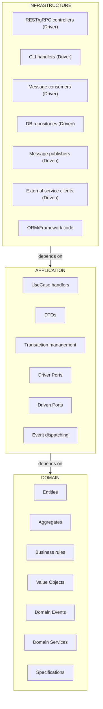

## 1. Core Principles

- **Dependencias siempre hacia adentro:**
  `Infrastructure → Application → Domain`
- **Domain nunca depende de:** application, infrastructure, librerías externas.
- **Application nunca depende de:** implementaciones de Infrastructure.
- **Solo interfaces cruzan límites.**

---

## 2. Enterprise Feature Structure (Go Modules)

Cada feature es un módulo independiente compilable vía `go.work`:

```
/features/
  orders/
    go.mod
    domain/
    application/
    infrastructure/
  users/
    go.mod
    domain/
    application/
    infrastructure/
/shared/
  kernel/
  go.mod
/cmd/
  api/
    main.go
```

- Cada feature se compila de forma independiente.
- Refuerza límites de arquitectura a nivel de módulo Go.

---

## 3. Feature Internal Structure (Strict)

```
orders/
├── domain/
│   ├── aggregate/order.go
│   ├── valueobject/
│   ├── event/
│   ├── service/
│   ├── repository.go
│   └── errors.go
├── application/
│   ├── port/driver/place_order.go
│   ├── port/driven/order_repository.go
│   ├── usecase/place_order/command.go
│   ├── usecase/place_order/handler.go
│   └── dto/
└── infrastructure/
    ├── adapter/driver/http/handler.go
    └── adapter/driven/postgres/repository.go
    └── config/
```

- No cross-imports entre features.
- Comunicación entre features **solo vía Application Services, Domain Events o Messaging**.

---

## 4. Layer Rules

### Domain Layer (Pure Core)

- No external imports, no `context`, no DB/HTTP, no JSON tags.
- Contiene: Entities, Aggregates, Value Objects (inmutables), Domain Events, Repository interfaces.

```go
package aggregate

type Order struct {
    id    OrderID
    total Money
}

func (o *Order) Confirm() error {
    if o.total.IsZero() {
        return ErrInvalidTotal
    }
    return nil
}
```

### Application Layer

- Contiene ports (driver / driven), use case handlers, DTOs.
- No domain structs expuestos externamente.

**Driver Port:**

```go
type PlaceOrderPort interface {
    Execute(cmd PlaceOrderCommand) (OrderID, error)
}
```

**Driven Port:**

```go
type OrderRepository interface {
    Save(ctx context.Context, order *domain.Order) error
    FindByID(ctx context.Context, id domain.OrderID) (*domain.Order, error)
}
```

**Use Case Handler:**

```go
type Handler struct {
    repo driven.OrderRepository
}

func New(repo driven.OrderRepository) *Handler {
    return &Handler{repo: repo}
}

func (h *Handler) Execute(cmd driver.PlaceOrderCommand) (domain.OrderID, error) {
    order := domain.NewOrder(cmd.Total)
    if err := order.Confirm(); err != nil {
        return "", err
    }
    if err := h.repo.Save(context.Background(), order); err != nil {
        return "", err
    }
    return order.ID(), nil
}
```

### Infrastructure Layer

- Implementa ports, nunca define reglas de negocio.
- Driver Adapter (HTTP, gRPC, CLI) → maps transport → driver port.
- Driven Adapter (DB, Redis, API) → implementa port → SDK/SQL calls, sin reglas de dominio.

---

## 5. Decision Trees & Cheatsheet

### Where does this code go?

```
Business rule? → Domain
Orchestrates use case? → Application
External systems (DB/API/UI)? → Infrastructure
Else → Reconsider
```

### Entity vs Value Object

```
Unique identity? → Entity
Defined by attributes? → Value Object
Else → Probably Entity
```

### Aggregate boundary

```
Must objects change atomically? → Same aggregate
Can exist independently? → Different aggregates
Else → Probably same aggregate
```

### Domain Service or Entity method

```
Belongs to one entity? → Entity method
Requires multiple aggregates? → Domain Service
Stateless business logic? → Domain Service
Else → Reconsider
```

### Aggregate Rules

- Only aggregate root saved/loaded via repository.
- Internal entities never persisted directamente.
- Cross-aggregate references use IDs only.
- All invariants enforced inside aggregate.

### Domain Purity Rules

- No panic, logging, context, external deps.
- Return business errors only.

### Transaction Boundary Rule

- Start/end in Application.
- Domain unaware of transactions.
- Infrastructure implements transactions.

---

## 6. Testing Strategy

- **Domain:** unit tests, no mocks.
- **Application:** mock driven ports, no DB.
- **Infrastructure:** integration tests, no domain assertions.
- **System:** end-to-end via adapters.

---

## 7. Diagrams (Mermaid)



## Reference Documentation

| File                                                       | Purpose                                          |
| ---------------------------------------------------------- | ------------------------------------------------ |
| [references/LAYERS.md](references/LAYERS.md)               | Complete layer specifications                    |
| [references/DDD-STRATEGIC.md](references/DDD-STRATEGIC.md) | Bounded contexts, context mapping                |
| [references/DDD-TACTICAL.md](references/DDD-TACTICAL.md)   | Entities, value objects, aggregates (pseudocode) |
| [references/HEXAGONAL.md](references/HEXAGONAL.md)         | Ports, adapters, naming                          |
| [references/CQRS-EVENTS.md](references/CQRS-EVENTS.md)     | Command/query separation, events                 |
| [references/TESTING.md](references/TESTING.md)             | Unit, integration, architecture tests            |
| [references/CHEATSHEET.md](references/CHEATSHEET.md)       | Quick decision guide                             |

## Sources

### Primary Sources

- [The Clean Architecture](https://blog.cleancoder.com/uncle-bob/2012/08/13/the-clean-architecture.html) — Robert C. Martin (2012)
- [Hexagonal Architecture](https://alistair.cockburn.us/hexagonal-architecture/) — Alistair Cockburn (2005)
- [Domain-Driven Design: The Blue Book](https://www.domainlanguage.com/ddd/blue-book/) — Eric Evans (2003)
- [Implementing Domain-Driven Design](https://openlibrary.org/works/OL17392277W) — Vaughn Vernon (2013)

### Pattern References

- [CQRS](https://martinfowler.com/bliki/CQRS.html) — Martin Fowler
- [Event Sourcing](https://martinfowler.com/eaaDev/EventSourcing.html) — Martin Fowler
- [Repository Pattern](https://martinfowler.com/eaaCatalog/repository.html) — Martin Fowler (PoEAA)
- [Unit of Work](https://martinfowler.com/eaaCatalog/unitOfWork.html) — Martin Fowler (PoEAA)
- [Bounded Context](https://martinfowler.com/bliki/BoundedContext.html) — Martin Fowler
- [Transactional Outbox](https://microservices.io/patterns/data/transactional-outbox.html) — microservices.io
- [Effective Aggregate Design](https://www.dddcommunity.org/library/vernon_2011/) — Vaughn Vernon

### Implementation Guides

- [Microsoft: DDD + CQRS Microservices](https://learn.microsoft.com/en-us/dotnet/architecture/microservices/microservice-ddd-cqrs-patterns/)
- [Domain Events](https://udidahan.com/2009/06/14/domain-events-salvation/) — Udi Dahan
