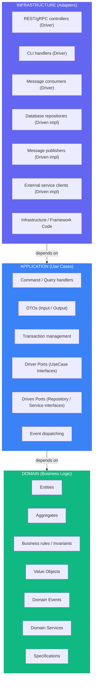
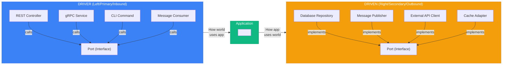

# Quick Reference Cheatsheet

> See [SKILL.md](../SKILL.md#sources) for full source list.

---

## Layer Summary



_Dependencies point inward_

---

## Quick Decision Trees

### "Where does this code go?"

```
Is it a business rule or constraint?
├── YES → Domain layer
└── NO ↓

Is it orchestrating a use case?
├── YES → Application layer
└── NO ↓

Is it dealing with external systems (DB, API, UI)?
├── YES → Infrastructure layer
└── NO → Reconsider; probably domain
```

### "Entity or Value Object?"

```
Does it have a unique identity that persists?
├── YES → Entity
└── NO ↓

Is it defined entirely by its attributes?
├── YES → Value Object
└── NO → Probably an Entity
```

### "Aggregate boundary?"

```
Must these objects change together atomically?
├── YES → Same aggregate
└── NO ↓

Can one exist without the other?
├── YES → Different aggregates (reference by ID)
└── NO → Probably same aggregate
```

### "Domain Service or Entity method?"

```
Does it naturally belong to one entity?
├── YES → Entity method
└── NO ↓

Does it require multiple aggregates?
├── YES → Domain Service
└── NO ↓

Is it stateless business logic?
├── YES → Domain Service
└── NO → Reconsider placement
```

---

## Aggregate Rules

- Only Aggregate Root is loaded/saved through repository.
- Internal entities are never persisted directly.
- Cross-aggregate references must use IDs only.
- All business invariants enforced inside the aggregate root.

---

## Domain Purity Rules

- Domain returns **business errors only**.
- No `panic` or logging inside domain.
- No `context.Context` or external dependencies.
- No mutable global state.
- Domain must compile if infrastructure is removed.

---

## Transaction Boundary Rule

- Transactions start and end in **Application layer**.
- Domain is **unaware of transactions**.
- Infrastructure provides concrete transaction implementation.
- Example: `Application → Infrastructure Transaction → Database`

---

## Vertical Slice Rules

- One folder per use case.
- No shared handlers between slices.
- Share **domain only**.
- Minimize slice-to-slice coupling.

---

## Testing Strategy

- **Domain**: pure unit tests, table-driven tests, no mocks.
- **Application**: mock-driven ports for isolation.
- **Infrastructure**: integration tests.
- **No mocks inside domain.**

---

## Common Patterns Quick Reference

### Value Object Template (Go)

```go
package money

type Money struct {
	amount   int64
	currency string
}

func NewMoney(amount int64, currency string) (Money, error) {
	if amount < 0 {
		return Money{}, ErrNegativeAmount
	}
	return Money{amount: amount, currency: currency}, nil
}

func (m Money) Add(other Money) (Money, error) {
	if m.currency != other.currency {
		return Money{}, ErrCurrencyMismatch
	}
	return Money{amount: m.amount + other.amount, currency: m.currency}, nil
}

func (m Money) Equals(other Money) bool {
	return m.amount == other.amount && m.currency == other.currency
}
```

### Entity Template (Go)

```go
package domain

type OrderItem struct {
	id        OrderItemID
	productID ProductID
	quantity  Quantity
}

func NewOrderItem(productID ProductID, quantity Quantity) OrderItem {
	return OrderItem{
		id:        NewOrderItemID(),
		productID: productID,
		quantity:  quantity,
	}
}

func (o *OrderItem) IncreaseQuantity(amount Quantity) {
	o.quantity = o.quantity.Add(amount)
}

func (o OrderItem) ID() OrderItemID {
	return o.id
}
```

### Aggregate Root Template (Go)

```go
package domain

type Order struct {
	id     OrderID
	items  []OrderItem
	status OrderStatus
	events []DomainEvent
}

func NewOrder(customerID CustomerID) *Order {
	o := &Order{id: NewOrderID(), status: StatusDraft}
	o.addEvent(NewOrderCreated(o.id, customerID))
	return o
}

func (o *Order) AddItem(productID ProductID, quantity Quantity, price Money) {
	o.assertCanModify()
	o.items = append(o.items, NewOrderItem(productID, quantity))
}

func (o *Order) Confirm() error {
	o.assertCanModify()
	if len(o.items) == 0 {
		return ErrEmptyOrder
	}
	o.status = StatusConfirmed
	o.addEvent(NewOrderConfirmed(o.id))
	return nil
}

func (o *Order) assertCanModify() {
	if o.status == StatusCancelled {
		panic("order cancelled")
	}
}

func (o *Order) PullEvents() []DomainEvent {
	events := o.events
	o.events = nil
	return events
}

func (o *Order) addEvent(e DomainEvent) {
	o.events = append(o.events, e)
}
```

### Repository Interface Template (Go)

```go
package driven

import "context"

type OrderRepository interface {
	FindByID(ctx context.Context, id domain.OrderID) (*domain.Order, error)
	Save(ctx context.Context, order *domain.Order) error
	Delete(ctx context.Context, order *domain.Order) error
}
```

### Use Case Handler Template (Go)

```go
package placeorder

type Handler struct {
	orderRepo   driven.OrderRepository
	productRepo driven.ProductRepository
	publisher   driven.EventPublisher
}

func NewHandler(
	orderRepo driven.OrderRepository,
	productRepo driven.ProductRepository,
	publisher driven.EventPublisher,
) *Handler {
	return &Handler{orderRepo: orderRepo, productRepo: productRepo, publisher: publisher}
}

func (h *Handler) Execute(ctx context.Context, cmd PlaceOrderCommand) (domain.OrderID, error) {
	order := domain.NewOrder(cmd.CustomerID)
	for _, item := range cmd.Items {
		product, err := h.productRepo.FindByID(ctx, item.ProductID)
		if err != nil { return "", err }
		order.AddItem(product.ID(), item.Quantity, product.Price())
	}
	if err := h.orderRepo.Save(ctx, order); err != nil { return "", err }
	for _, event := range order.PullEvents() { _ = h.publisher.Publish(ctx, event) }
	return order.ID(), nil
}
```

---

## Port Naming Conventions

| Type        | Pattern                | Examples                                |
| ----------- | ---------------------- | --------------------------------------- |
| Driver Port | `{Action}UseCase`      | `PlaceOrderUseCase`, `GetOrderUseCase`  |
| Driven Port | `{Resource}Repository` | `OrderRepository`, `ProductRepository`  |
| Driven Port | `{Action}Service`      | `PaymentService`, `NotificationService` |
| Driven Port | `{Resource}Gateway`    | `PaymentGateway`, `ShippingGateway`     |

---

## Common Anti-Patterns

| Anti-Pattern         | Problem                      | Solution                     |
| -------------------- | ---------------------------- | ---------------------------- |
| Anemic Domain        | Entities are just data bags  | Put behavior in entities     |
| Repository per table | One repo per DB table        | One repo per aggregate       |
| Fat Use Cases        | Business logic in handlers   | Move to domain               |
| Leaky Abstraction    | Domain depends on ORM        | Keep domain pure             |
| God Aggregate        | One massive aggregate        | Split into smaller ones      |
| Cross-Aggregate TX   | Modifying multiple in one TX | Use domain events            |
| Direct Layer Skip    | Controller → Repository      | Go through application layer |
| Premature CQRS       | Adding complexity early      | Start simple, evolve         |
| Event Proliferation  | Too many fine-grained events | May signal context boundary  |

---

## Dependency Rules Matrix

|                    | Domain | Application | Infrastructure |
| ------------------ | ------ | ----------- | -------------- |
| **Domain**         | ✅     | ❌          | ❌             |
| **Application**    | ✅     | ✅          | ❌             |
| **Infrastructure** | ✅     | ✅          | ✅             |

✅ = Can depend on
❌ = Cannot depend on

---

## Go-Specific Rules

- No JSON tags in domain.
- No ORM models in domain.
- Interfaces live where they are consumed.
- No global mutable state.
- Domain must compile if infrastructure is deleted.

---

## Hexagonal Quick Reference



---

## File Naming Conventions (Go)

```
domain/
├── order/
│   ├── order.go
│   ├── order_item.go
│   ├── value_objects.go
│   ├── events.go
│   ├── repository.go
│   ├── services.go
│   └── errors.go

application/
├── place_order/
│   ├── command.go
│   ├── handler.go
│   └── port.go

infrastructure/
├── postgres/
│   ├── order_repository.go
│   └── mappers/
│       └── order_mapper.go
```

---

## Resources

### Books

- Clean Architecture (Robert C. Martin, 2017)
- Domain-Driven Design (Eric Evans, 2003)
- Implementing Domain-Driven Design (Vaughn Vernon, 2013)
- Hexagonal Architecture Explained (Alistair Cockburn, 2024)
- Get Your Hands Dirty on Clean Architecture (Tom Hombergs, 2019)

### Reference Implementations

- Go: [bxcodec/go-clean-arch](https://github.com/bxcodec/go-clean-arch)
- Rust: [flosse/clean-architecture-with-rust](https://github.com/flosse/clean-architecture-with-rust)
- Python: [cdddg/py-clean-arch](https://github.com/cdddg/py-clean-arch)
- TypeScript: [jbuget/nodejs-clean-architecture-app](https://github.com/jbuget/nodejs-clean-architecture-app)
- .NET: [jasontaylordev/CleanArchitecture](https://github.com/jasontaylordev/CleanArchitecture)
- Java: [thombergs/buckpal](https://github.com/thombergs/buckpal)

### Official Documentation

- [https://blog.cleancoder.com/uncle-bob/2012/08/13/the-clean-architecture.html](https://blog.cleancoder.com/uncle-bob/2012/08/13/the-clean-architecture.html)
- [https://alistair.cockburn.us/hexagonal-architecture/](https://alistair.cockburn.us/hexagonal-architecture/)
- [https://www.domainlanguage.com/ddd/](https://www.domainlanguage.com/ddd/)
- [https://martinfowler.com/tags/domain%20driven%20design.html](https://martinfowler.com/tags/domain%20driven%20design.html)
