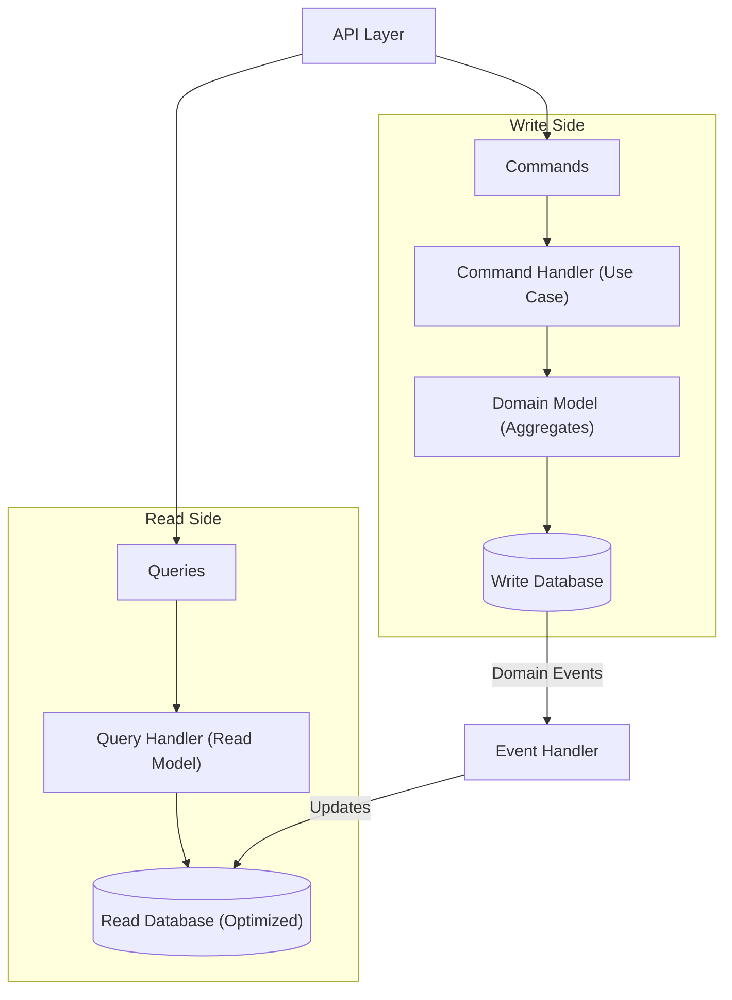

# CQRS & Domain Events

> Sources:
>
> - [CQRS](https://martinfowler.com/bliki/CQRS.html) — Martin Fowler
> - [Event Sourcing](https://martinfowler.com/eaaDev/EventSourcing.html) — Martin Fowler
> - [CQRS Pattern](https://learn.microsoft.com/en-us/azure/architecture/patterns/cqrs) — Microsoft Azure
> - [Transactional Outbox](https://microservices.io/patterns/data/transactional-outbox.html) — microservices.io
> - [Domain Events – Salvation](https://udidahan.com/2009/06/14/domain-events-salvation/) — Udi Dahan
> - [Strengthening Your Domain: Domain Events](https://lostechies.com/jimmybogard/2010/04/08/strengthening-your-domain-domain-events/) — Jimmy Bogard
> - [Domain Events: Design and Implementation](https://learn.microsoft.com/en-us/dotnet/architecture/microservices/microservice-ddd-cqrs-patterns/domain-events-design-implementation) — Microsoft

## 1. CQRS Overview

Separar **Write (Commands)** y **Read (Queries)** en modelos distintos.



---

## 2. Commands (Write Side)

- Representan **intención de cambiar estado**.
- Mutan datos únicamente.
- Go: structs + interfaces + handlers.

```go
// application/commands/place_order.go
type PlaceOrderCommand struct {
    CustomerID string
    Items      []OrderItemDTO
}

type OrderItemDTO struct {
    ProductID string
    Quantity  int
}

// Command handler
type PlaceOrderHandler struct {
    repo          OrderRepository
    eventPublisher EventPublisher
}

func (h *PlaceOrderHandler) Handle(cmd PlaceOrderCommand) (string, error) {
    order := domain.NewOrder(cmd.CustomerID)

    for _, item := range cmd.Items {
        prod, _ := h.repo.FindProductByID(item.ProductID)
        order.AddItem(prod.ID, item.Quantity, prod.Price)
    }

    if err := h.repo.Save(order); err != nil {
        return "", err
    }

    return order.ID(), h.eventPublisher.PublishAll(order.DomainEvents())
}
```

---

## 3. Queries (Read Side)

- Recuperan datos **sin efectos secundarios**.
- Go: structs + interfaces.

```go
// application/queries/get_order.go
type GetOrderQuery struct{ OrderID string }
type OrderDTO struct {
    ID          string
    CustomerID  string
    Status      string
    Items       []OrderItemDTO
    Total       float64
    CreatedAt   time.Time
    ConfirmedAt *time.Time
}

type GetOrderHandler struct {
    readModel OrderReadModel
}

func (h *GetOrderHandler) Handle(q GetOrderQuery) (*OrderDTO, error) {
    return h.readModel.FindByID(q.OrderID)
}
```

---

## 4. Domain Events

- Notifican que algo sucedió en dominio.
- Se usan para **Read Model updates** y comunicación entre agregados.

```go
// domain/events/domain_event.go
type DomainEvent interface {
    EventID() string
    OccurredAt() time.Time
    AggregateID() string
    EventType() string
    Payload() map[string]interface{}
}

// domain/order/events.go
type OrderCreated struct {
    OrderID    string
    CustomerID string
    occurredAt time.Time
}

func (e OrderCreated) EventID() string       { return uuid.New().String() }
func (e OrderCreated) OccurredAt() time.Time { return e.occurredAt }
func (e OrderCreated) AggregateID() string   { return e.OrderID }
func (e OrderCreated) EventType() string     { return "order.created" }
func (e OrderCreated) Payload() map[string]interface{} {
    return map[string]interface{}{"orderId": e.OrderID, "customerId": e.CustomerID}
}
```

---

## 5. Event Handlers

- Actualizan Read Models o disparan Integration Events.

```go
type OrderCreatedHandler struct {
    readDb OrderReadModel
}

func (h *OrderCreatedHandler) Handle(event OrderCreated) error {
    return h.readDb.Insert(OrderDTO{
        ID:         event.OrderID,
        CustomerID: event.CustomerID,
        Status:     "draft",
        CreatedAt:  event.OccurredAt(),
    })
}
```

- **Idempotencia:** guardar EventID procesados o usar broker deduplication.

---

## 6. Integration Events

- Cross-bounded-context.
- Versionados y enviados a message broker.

```go
type OrderConfirmedIntegrationEvent struct {
    EventType string `json:"eventType"`
    EventID   string `json:"eventId"`
    Version   string `json:"version"`
    Occurred  time.Time `json:"occurredAt"`
    Payload   struct {
        OrderID    string
        CustomerID string
        Total      float64
    }
}
```

---

## 7. Event Dispatcher (Go)

```go
type EventHandler[T DomainEvent] interface {
    Handle(event T) error
}

type EventDispatcher struct {
    handlers map[string][]interface{}
}

func NewEventDispatcher() *EventDispatcher {
    return &EventDispatcher{handlers: make(map[string][]interface{})}
}

func (d *EventDispatcher) Register(eventType string, handler interface{}) {
    d.handlers[eventType] = append(d.handlers[eventType], handler)
}

func (d *EventDispatcher) Dispatch(event DomainEvent) error {
    hs := d.handlers[event.EventType()]
    for _, h := range hs {
        h.(EventHandler[DomainEvent]).Handle(event)
    }
    return nil
}
```

---

## 8. Outbox Pattern

- Garantiza **exactly-once** event publishing.
- Guardar evento dentro de la misma transacción que el aggregate.

```go
type OutboxMessage struct {
    ID        string
    EventType string
    Payload   string
    CreatedAt time.Time
    Processed *time.Time
}

type OutboxRepository interface {
    Save(event DomainEvent, tx Tx) error
    GetUnprocessed(limit int) ([]OutboxMessage, error)
    MarkProcessed(id string) error
}
```

---

## 9. Saga Pattern (Cross-Aggregate Workflows)

```go
type PlaceOrderSaga struct {
    inventorySvc InventoryService
    paymentSvc   PaymentService
    orderRepo    OrderRepository
}

func (s *PlaceOrderSaga) Execute(cmd PlaceOrderCommand) error {
    if err := s.inventorySvc.Reserve(cmd.Items); err != nil {
        return err
    }
    if err := s.paymentSvc.Process(cmd.CustomerID, cmd.Items); err != nil {
        s.inventorySvc.Release(cmd.Items)
        return err
    }
    return s.orderRepo.Confirm(cmd)
}
```

- **Choreography:** event-driven
- **Orchestration:** central coordinator

---

## 10. When to Use

- Read/write workloads **differ mucho**.
- Event sourcing o audit completo necesario.
- CQRS + ES juntos son naturales.

**Evitar:** CRUD simple, pequeña app, prototipo, dominio simple.
