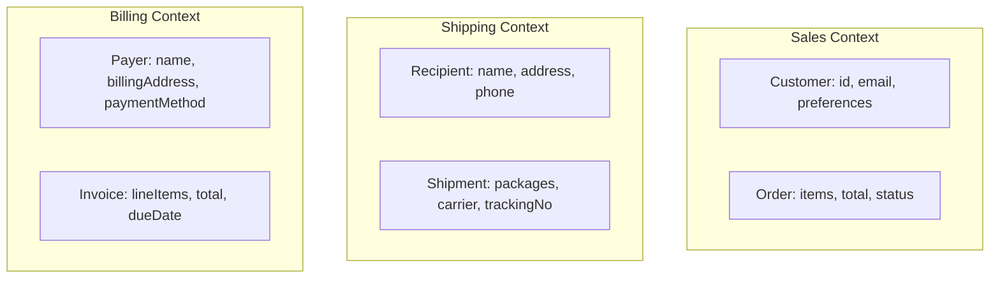

# DDD Strategic Patterns (Adaptado a Go / Arquitectura Modular)

> Sources:
>
> - [Domain-Driven Design: The Blue Book](https://www.domainlanguage.com/ddd/blue-book/) — Eric Evans (2003)
> - [DDD Resources](https://www.domainlanguage.com/ddd/) — Domain Language (Eric Evans)
> - [Bounded Context](https://martinfowler.com/bliki/BoundedContext.html) — Martin Fowler
> - [Domain Driven Design](https://martinfowler.com/bliki/DomainDrivenDesign.html) — Martin Fowler
> - [Anti-Corruption Layer](https://docs.aws.amazon.com/prescriptive-guidance/latest/cloud-design-patterns/acl.html) — AWS
> - [Domain Analysis for Microservices](https://learn.microsoft.com/en-us/azure/architecture/microservices/model/domain-analysis) — Microsoft

## Overview

Patrones estratégicos de DDD adaptados a Go y arquitectura modular.
Ayudan a **dividir sistemas complejos** en paquetes y módulos independientes, con límites claros y eventos de dominio explícitos.

---

## Domain Discovery Techniques

### Event Storming

```text
Orange sticky: Domain Event ("OrderPlaced")
Blue sticky: Command ("PlaceOrder")
Yellow sticky: Aggregate ("Order")
Pink sticky: External System / Policy
Purple sticky: Problem / Question
```

**Flujo de taller:**

1. Explorar eventos conocidos (todos participan)
2. Ordenar cronológicamente
3. Identificar agregados
4. Definir límites de contextos
5. Detectar problemas o ambigüedades

### Context Mapping Workshop

1. Listar sistemas/servicios
2. Identificar responsables
3. Dibujar relaciones (upstream/downstream)
4. Etiquetar tipos de relación (ACL, Conformist, etc.)
5. Marcar puntos críticos de integración

---

## Ubiquitous Language

Lenguaje compartido entre desarrolladores y expertos de dominio.

- Usar en **paquetes Go**, nombres de structs, métodos y documentación.
- Evoluciona junto con el dominio.

```go
// ❌ Técnico
type Order struct {
    status int
}
func (o *Order) SetStatus(status int) { o.status = status }

// ✅ Ubiquitous Language
type Order struct {
    ID          OrderID
    Status      OrderStatus
    ConfirmedAt time.Time
    domainEvents []DomainEvent
}

func (o *Order) Confirm() error {
    if o.Status != Pending {
        return fmt.Errorf("order %s cannot be confirmed", o.ID)
    }
    o.Status = Confirmed
    o.ConfirmedAt = time.Now()
    o.domainEvents = append(o.domainEvents, NewOrderConfirmedEvent(o.ID))
    return nil
}
```

---

## Bounded Contexts

Cada contexto tiene:

- Lenguaje propio
- Modelo independiente
- Representación distinta de conceptos comunes



---

## Subdomains

| Type           | Description             | Example                     |
| -------------- | ----------------------- | --------------------------- |
| **Core**       | Ventaja competitiva     | Motor de recomendaciones    |
| **Supporting** | Necesario pero no único | Gestión de pedidos          |
| **Generic**    | Commodity               | Autenticación, pagos, email |

---

## Context Mapping

### Relación de contextos

- **Partnership:** coordinación estrecha
- **Shared Kernel:** comparten subset de modelo
- **Customer-Supplier:** upstream provee datos
- **Conformist:** downstream se adapta sin negociar
- **ACL:** traducción para proteger modelo propio
- **Open Host Service / Published Language:** exponer API o esquema estándar

```go
// Ejemplo ACL en Go
type StripePaymentACL struct {
    stripeClient *StripeClient
}

func (acl *StripePaymentACL) CreatePayment(payment Payment) (string, error) {
    intent := acl.stripeClient.CreatePaymentIntent(payment.AmountCents, payment.Currency, payment.Metadata)
    return intent.ID, nil
}

func (acl *StripePaymentACL) TranslateStatus(stripeStatus string) PaymentStatus {
    mapping := map[string]PaymentStatus{
        "requires_payment_method": Pending,
        "succeeded": Completed,
        "canceled": Cancelled,
    }
    if s, ok := mapping[stripeStatus]; ok {
        return s
    }
    return Unknown
}

func (acl *StripePaymentACL) TranslateWebhook(event StripeEvent) DomainEvent {
    switch event.Type {
    case "payment_intent.succeeded":
        return NewPaymentCompletedEvent(PaymentID(event.Metadata.OrderID), event.AmountCents, event.Currency)
    default:
        return nil
    }
}
```

---

## Domain Events para Integración

```go
type OrderPlaced struct {
    EventID     string
    OrderID     string
    CustomerID  string
    Items       []OrderItem
    Total       float64
    ShippingAddr Address
    OccurredAt  time.Time
}

func (h *ShippingOrderPlacedHandler) Handle(event OrderPlaced) error {
    shipment := NewShipment(event.OrderID, event.ShippingAddr, calculatePackages(event.Items))
    return h.shipmentRepo.Save(shipment)
}

func (h *BillingOrderPlacedHandler) Handle(event OrderPlaced) error {
    invoice := NewInvoice(event.OrderID, event.CustomerID, mapItemsToLineItems(event.Items), event.Total)
    return h.invoiceRepo.Save(invoice)
}
```

---

## Strategic Design Checklist

- [ ] Identificar términos de lenguaje ubicuo
- [ ] Mapear subdominios (core, supporting, generic)
- [ ] Definir límites de bounded contexts
- [ ] Documentar mapa de contexto y relaciones
- [ ] Diseñar capas ACL para sistemas externos
- [ ] Definir esquemas de eventos de integración
- [ ] Asegurar que cada contexto tenga su propio datastore
